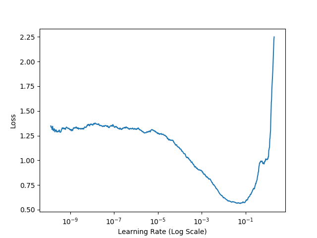
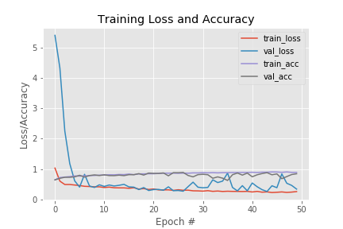

FIRE AND SMOKE DETECTION USING KERAS ...🔥🔥

In this project, I have created a Deep Learning model to detect fire and smoke using Computer Vision, OpenCV, and the Keras Deep Learning library.

I have used Data Augmentation to increase the volume of my image dataset and I got a very satisfying accuracy of about 90% on a dataset like this. 

Also, I have used a learning rate finder in this project which trains for 20 epochs and finds you the best learning rate in the range you provide.

You can further extend this idea by using it with a Raspberry Pi, a thermal sensor and a camera for its practical implementation.

Steps to tackle with datasets:
Download both datasets
Run the bash script (prune.sh)
Then delete robbery and accident folders
Label the folder as fire and non fire respectively and place them in a directory called Image Dataset

Fire dataset --> https://drive.google.com/file/d/11KBgD_W2yOxhJnUMiyBkBzXDPXhVmvCt/view
non fire dataset --> https://people.csail.mit.edu/torralba/code/spatialenvelope/spatial_envelope_256x256_static_8outdoorcategories.zip

Learning rate curve

Training and loss curve 

Your Image dataset directory should look like this 

